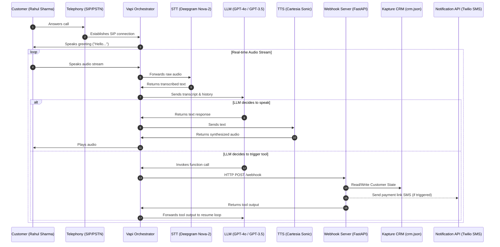
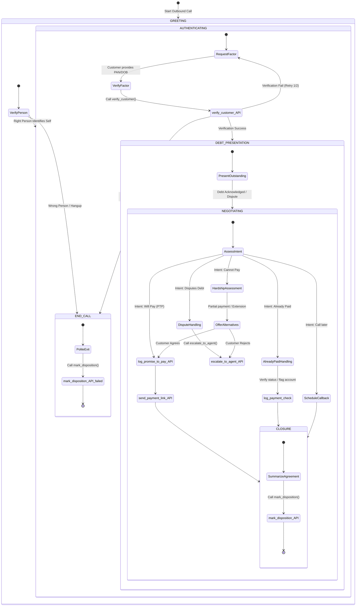

# High-Level Design (HLD): Kapture Finance Collections Voicebot ("Maya")

This document details the architecture, conversation state machine, compliance frameworks, tool specifications, and metrics for **Maya**, an outbound collections voicebot designed for **Kapture Finance**. 

---

## 1. System Architecture & Pipeline

The system is designed as a low-latency, real-time voice pipeline. Vapi.ai acts as the primary voice orchestrator, coordinating telephony, speech-to-text (STT), the LLM reasoning loop, and text-to-speech (TTS), and integrating with Kapture's mock webhook backend.

### 1.1 Architecture Diagram

### 1.2 Latency Budgets (Per Hop)
To maintain a natural human conversation flow, the round-trip latency (Silence-to-Speech) must be **< 1,200ms** (target: **800ms**).
*   **Audio Ingestion & STT (Deepgram Nova-2):** ~150ms - 200ms
*   **Orchestration & Network Transit:** ~100ms
*   **LLM Processing (GPT-4o-mini / GPT-4o first token):** ~250ms - 400ms
*   **TTS Synthesis (Cartesia Streamed):** ~100ms - 150ms
*   **Webhook / Tool Execution:** ~150ms (optimized through async execution for non-blocking SMS)

---

## 2. Conversation Flow & State Machine

To comply with debt collection privacy standards, the state transitions are **strictly locked** by the orchestrator state engine. The bot is strictly forbidden from disclosing any details of the debt before verifying identity.

---

## 3. Intents, Entities & Extraction

| Intent Name | Description | Triggers / Utterances | Entities Extracted |
|---|---|---|---|
| **will-pay** | Agrees to clear the due payment | "I will pay tomorrow", "Send the link", "I can pay online now" | `ptp_date` (ISO Date), `ptp_amount` (number), `payment_method` (UPI, Card, NetBanking) |
| **cannot-pay** | Financial hardship or temporary cash crunch | "I lost my job", "I don't have money", "I can't pay right now" | `hardship_reason` (string) |
| **already-paid** | Claims the payment is already done | "I paid it yesterday", "Money was debited", "Transaction is complete" | `payment_date` (date), `ref_number` (string) |
| **dispute** | Disputes amount or the loan itself | "This amount is wrong", "I never took this loan", "I paid this EMI" | `dispute_reason` (string) |
| **callback-request**| Requests a call at a later time | "Call me after 5 PM", "I am in a meeting, call later" | `callback_time` (datetime) |
| **wrong-person** | Call receiver is not the debtor | "This is not Rahul", "Wrong number", "I don't know any Rahul" | N/A |
| **do-not-call** | Requesting DNC registry addition | "Stop calling me", "Add me to DNC", "Never call again" | N/A |
| **hostile** | Aggressive, abusive, or threatening | Abusive language, screaming, swearing | N/A |

---

## 4. Tools & Webhook API Specification

The LLM is equipped with 5 key tools to execute the workflow. The endpoints are exposed by the webhook server.

### 4.1 `verify_customer`
Verifies the customer identity before revealing debt information.
*   **Inputs:**
    *   `customer_id` (string, required): The ID of the customer (e.g., `cust_rahul_001`).
    *   `dob` (string, optional): Date of Birth in `YYYY-MM-DD` format.
    *   `last4PAN` (string, optional): Last 4 alphanumeric characters of PAN card (e.g., `4521`).
*   **Outputs:**
    *   `status` (string): `SUCCESS` or `FAILED`.
    *   `verified` (boolean): `true` or `false`.
    *   `message` (string): Human-readable status (e.g., "Verification successful").

### 4.2 `log_promise_to_pay`
Logs a formal promise-to-pay date and amount in Kapture CRM.
*   **Inputs:**
    *   `customer_id` (string, required): Customer identifier.
    *   `ptp_date` (string, required): Date customer promised to pay (`YYYY-MM-DD`).
    *   `ptp_amount` (number, required): The amount promised to pay.
*   **Outputs:**
    *   `status` (string): `SUCCESS` or `FAILED`.
    *   `ptp_id` (string): Unique log reference.

### 4.3 `send_payment_link`
Triggers an SMS/WhatsApp containing the secure payment link via mock engine.
*   **Inputs:**
    *   `customer_id` (string, required): Customer identifier.
    *   `payment_method` (string, required): Preferred mode (e.g., `UPI`, `Netbanking`, `Card`, `Any`).
*   **Outputs:**
    *   `status` (string): `SUCCESS` or `FAILED`.
    *   `delivery_channel` (string): SMS or WhatsApp status description.

### 4.4 `escalate_to_agent`
Initiates a transfer to a human collections supervisor.
*   **Inputs:**
    *   `customer_id` (string, required): Customer identifier.
    *   `reason` (string, required): Reason for escalation (`Dispute`, `Financial Hardship`, `Hostile User`, `Unresolved Language Switch`).
*   **Outputs:**
    *   `status` (string): `TRANSFER_INITIATED`.
    *   `queue_id` (string): Target desk ID.

### 4.5 `mark_disposition`
Logs the final call disposition code and call summary to Kapture CRM.
*   **Inputs:**
    *   `customer_id` (string, required): Customer identifier.
    *   `disposition_code` (string, required): Standard code (`PTP`, `ALREADY_PAID`, `DISPUTED`, `WRONG_NUMBER`, `DNC`, `REFUSED_PAYMENT`, `UNREACHABLE`, `CALL_BACK`).
    *   `call_notes` (string, required): Brief text summarizing the call outcome.
*   **Outputs:**
    *   `status` (string): `RECORDED`.

---

## 5. Security, Compliance & Guardrails

### 5.1 Auth & Data Safety (Preventing Third-Party Disclosure)
*   **No Unverified Disclosure:** Maya is forbidden from using terms like "debt", "overdue", "loan", "EMI", or "Kapture Finance" to anyone until they complete verification. If the receiver says "I am his brother/friend, what is this regarding?", Maya must say: *"I am calling on a personal business matter. Could you please have Mr. Rahul Sharma contact us, or let me know when he is available?"*
*   **Verification Verification Flow:** The customer must verify either their date of birth or the last 4 characters of their PAN card.
*   **Failed Auth Cap:** Maximum 2 failed verification attempts. After the second fail, Maya says: *"Unfortunately, we cannot verify the details at this time. Please call our customer care. Thank you."* then hangs up and records `VERIFICATION_FAILED`.

### 5.2 Regulatory Guardrails (RBI & Fair Practice Guidelines)
*   **Calling Hours Enforcement:** Dialing is restricted to permitted hours (e.g., 8:00 AM to 7:00 PM local time). The webhook gateway checks the timestamp and immediately returns an error or reschedule code if calls are placed outside hours.
*   **Mandatory Disclosure:** At the start of the call, Maya must disclose her name, company ("Kapture Finance"), and the general nature of the call (after verification: "regarding your outstanding loan EMI").
*   **Tone & Respectful Language:** Maya is programmed to remain polite, professional, and empathetic. She will never use aggressive language, threaten legal action, or harass.
*   **Hallucination / Off-topic Block:** If the customer asks off-topic questions (e.g., "What is the weather today?"), Maya redirects: *"I can only assist you with your Kapture Finance account today. Let's return to arranging the payment..."*

---

## 6. Observability & Performance Metrics

We will track the following metrics inside our analytics framework to debug and optimize:

1.  **Containment Rate:** % of calls resolved without transferring to a human agent.
2.  **Promise to Pay (PTP) Rate:** % of answered calls that result in a logged `PTP` status with a validated date.
3.  **Average Latency (RTT):** Round-trip time of speech-to-speech loops (STT + LLM + TTS). Target is < 1,200ms.
4.  **Drop Rate:** % of calls where the user hangs up mid-conversation (broken down by state to identify drop-off triggers).
5.  **Bilingual Switch Rate:** % of calls where the agent successfully switched between English and Hindi.
6.  **Do Not Call (DNC) Rate:** % of calls requesting DNC.
